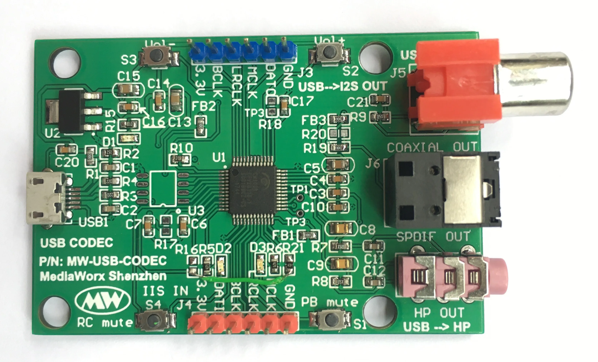
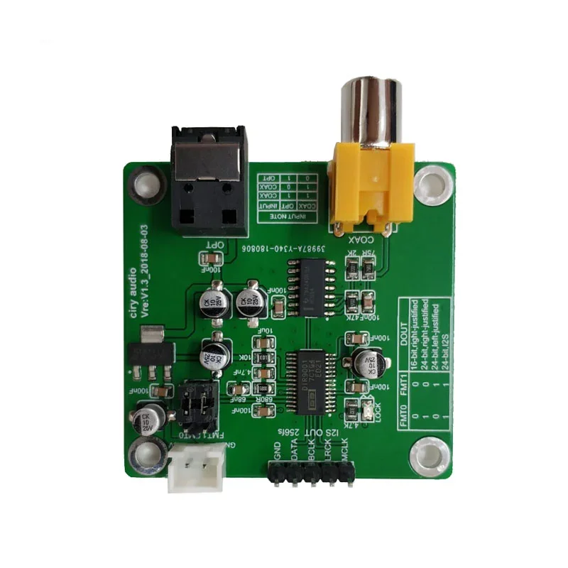
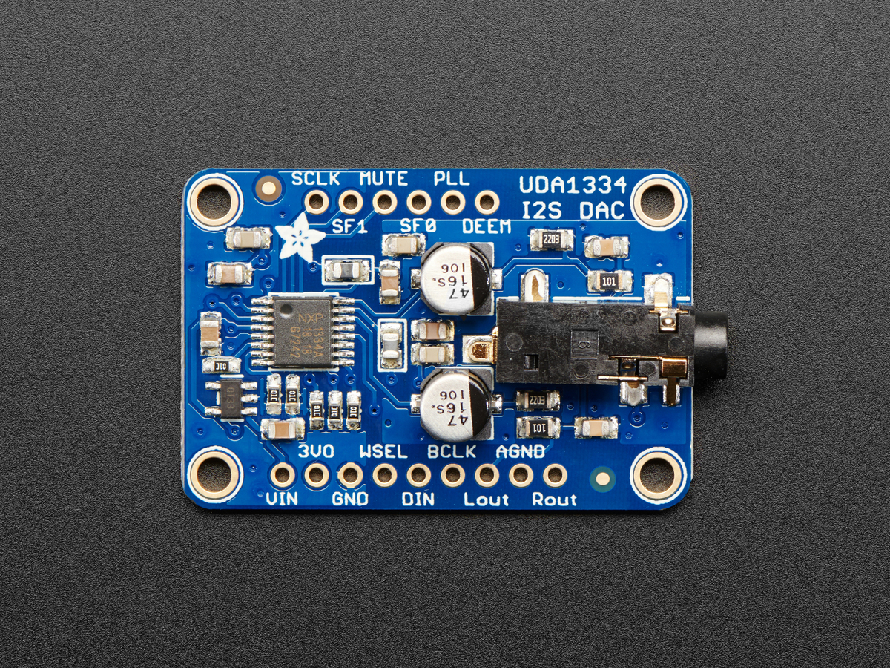

# Audio Chain

## Goal

* PC -> USB
* USB -> Toslink [USB_I2S_SPDIF_CM108B](../components/USB_I2S_SPDIF_CM108B) 
* Toslink -> I2S [SPDIF_to_I2C_DIR9001](../components/SPDIF_to_I2C_DIR9001)
* I2S -> Headset [I2S_DAC_UDA1334A](../components/I2S_DAC_UDA1334A)

## Cabeling

* GND&3V3 from USB_I2S_SPDIF_CM108B

* GND&3V3 from USB_I2S_SPDIF_CM108B
* I2S from SPDIF_to_I2C_DIR9001

| SPDIF_to_I2C_DIR9001 | I2S_DAC_UDA1334A |
| - | - |
| LRCK | WSEL |
| DATA | DIN |
| BCLK | BCLK |

Terms
* MCLK (Master Clock)
* BCLK (Bit Clock / Baud Clock)

## Decisions

### I2S: 3V3 / 5V?, Power: 3V3 / 5V?

* https://www.ti.com/lit/ds/symlink/dir9001.pdf

I2S: 0V .. 6.5V

* https://cdn-learn.adafruit.com/downloads/pdf/adafruit-i2s-stereo-decoder-uda1334a.pdf

Power&I2S: 3V3 .. 5V

## Bootstrap

### USB_I2S_SPDIF_CM108B

#### PC
Stimuli
* Connect Board via USB

Expected
* Output Devices appear
 * `Speakers - USB Audio Device`
 * `Digital Output (S/PDIF) - USB Audio Device`

#### Music
Stimuli
* Play Music on PC

Expected
* Music is played on Headset

#### Sawtooth

Preparation
* PC
 * Output Devices: `Speakers - USB Audio Device`

Stimuli
* while true; do aplay sawtooth.wav; sleep 1; done

Expected
* Noise on Headset
* USB_I2S_SPDIF_CM108B: Yello LED `D2` is on
 * This led starts blinking when sound is played.
 
#### PC
Preparation
* PC
 * Output Devices: `Digital Output (S/PDIF) - USB Audio Device`

Stimuli
* while true; do aplay sawtooth.wav; sleep 1; done

Expected
* Noise on Headset
* USB_I2S_SPDIF_CM108B: Yello LED `D2` is on
 * This led starts blinking when sound is played.
 * Scope: Pulse on middle Jack-connector
 * Scope: Signals on yello I2S pins
 * Scope: No Signals on blue I2S pins

**Conclusion: USB_I2S_SPDIF_CM108B did not deliver output to SPDIF**
